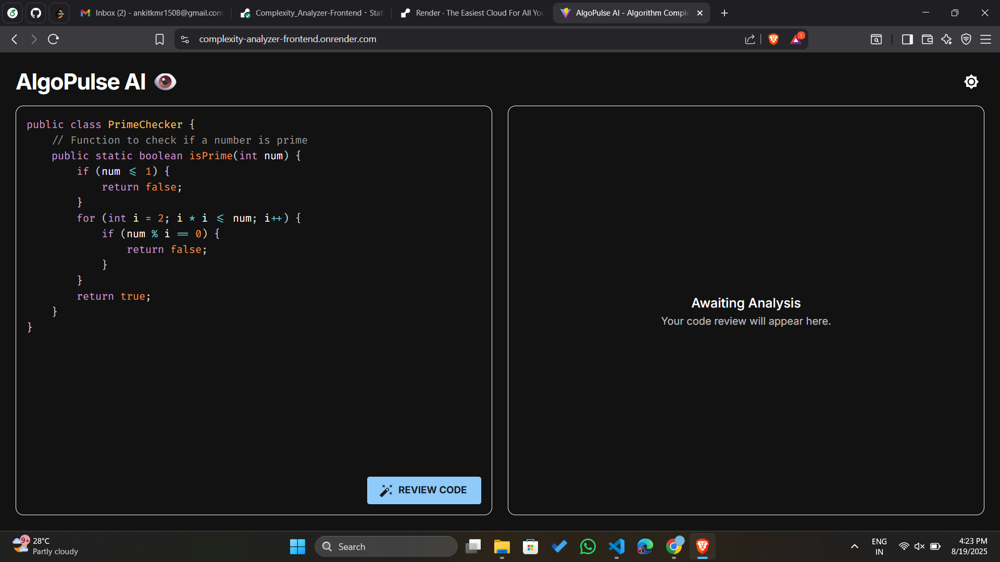
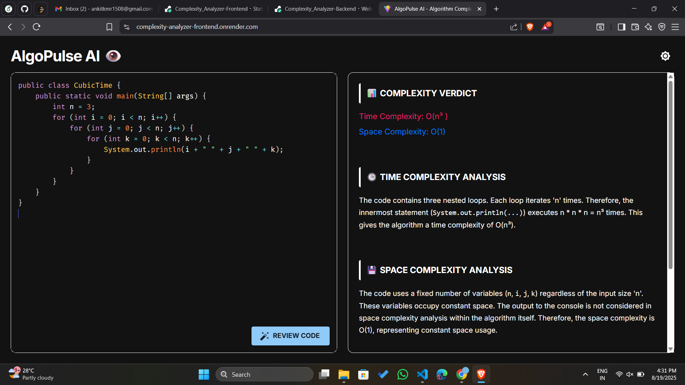

[](https://complexity-analyzer-frontend.onrender.com)

# 🚀 Complexity Analyzer

The **Complexity Analyzer** is an AI-powered tool that allows developers to paste their code and instantly get insights into its **time complexity** and **space complexity**, along with a human-readable explanation.  
Built with **React (frontend)** and **Express.js (backend)**, and powered by **AI models** for intelligent analysis.

🎯 **Live Demo:** [Click here to try it](https://complexity-analyzer-frontend.onrender.com)

---

## ✨ Features

- ⚡ **AI-Powered Complexity Analysis** – Get instant Big-O complexity for your code.  
- 📝 **Human-Readable Explanation** – Clear, modern text with breakdown of logic.  
- 🎨 **Modern UI** – Clean and responsive interface for better usability.  
- 🔍 **Multi-Language Support** (configurable) – Works for common programming languages.  
- 📋 **Real-Time Input/Output** – Paste your code, hit analyze, and view results instantly.  

---

## 📸 Screenshots

### 🔹 Code Input Editor


### 🔹 AI Complexity Analysis Output


---

## ⚙️ Getting Started

### ✅ Prerequisites
Make sure you have installed:
- [Node.js](https://nodejs.org/) (v16 or later)
- npm or yarn
- API key for AI integration (Gemini / OpenAI)

---

## 🛠 Installation

### Backend Setup
```bash
cd backend
npm install
node app.js
```

### Fronmtend Setup
```bash
cd frontend
npm install
npm run dev
```
